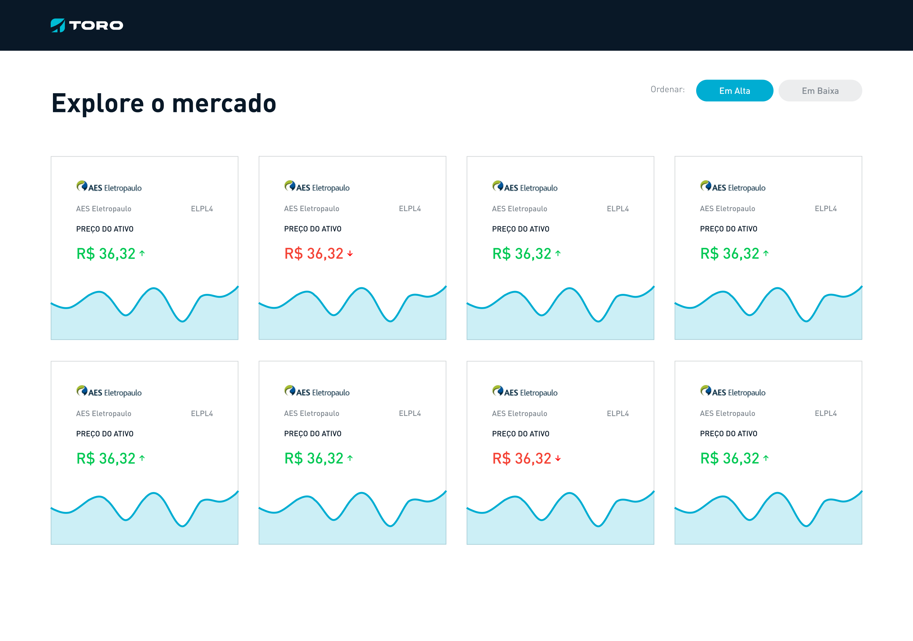

# Desafio Toro Desenvolvedor Front-End

Bem-vindo ao desafio de programação Front-End da Toro Investimentos.

## Problema

Reproduza um sistema front-end que exiba em tempo real, de forma organizada e agradável, preços de ações recebidas através de uma conexão websocket.
É preciso exibir pelo menos as 5 ações mais valorizadas e as 5 menos valorizadas em cards contendo o símbolo da ação, o preço atual e um gráfico que ilustre a evolução do preço.
As cotações devem ser recebidas a partir do nosso simulador de cotações que pode ser acessado usando docker com o seguinte comando: `docker run -p 8080:8080 toroinvestimentos/quotesmock`. O fluxo de cotações está no endpoint `/quotes`.

## Layout

Acesse o layer completo (Desk e Mobile) no Figma [neste link](https://www.figma.com/file/WWD46DsIYNhoipr3WSqFPb/TESTE-TORO-FRONT-END?node-id=0%3A1)

## Requisitos

- O layout produzido deve ser o mais proximo possível do disponibilizado e o styleguide deve ser respeitado
- Utilizar algum gerencimento de estado (terceiro ou próprio) para armazenar os dados obtidos do websocket
- Responsividade (versão mobile inclusa no Figma)
- Os cards não devem piscar (entrar e sair) na tela quando os ativos sofrerem alterações de preço que determine alta ou baixa
- O projeto deve ser publicado em um repositório público no github.com, bitbucket.org ou gitlab.com
- Testes automatizados
- README com instruções de como instalar as dependências do projeto, de como rodar a aplicação e como rodar os testes automatizados
- Deve ser desenvolvido em Javascript com ou sem Typescript

### Bônus

- Sistema executável através do docker-compose
- Usar o CI/CD da plataforma onde hospedar o código

## Critérios de Avaliação

Os seguintes critérios serão usados para avaliar sua UI:
- Estilização e hierarquia
- Proximidade com o layout idealizado
- Técnicas de renderização e manipulação do DOM
- Sensibilidade com UI e senso crítico
- 

Os seguintes critérios serão usados para avaliar o seu código:
- Lógica para transformação de dados
- Estrutura do projeto
- Legibilidade
- Escopo
- Organização do código
- Padrões de projeto
- Existência e quantidade de bugs e gambiarras
- Qualidade e cobertura dos testes
- Documentação
- Contexto e cadência dos commits

## Dúvidas

Caso surjam dúvidas entre em contato conosco pelo nosso email: desafiotoro@toroinvestimentos.com.br
